*This project has been created as part of the 42 curriculum by [jesequie].*

---

## Description

**get_next_line** is a project from the 42 curriculum that consists of writing a function able to read a text file line by line, regardless of the file size or the size of the read buffer used internally. The function must be called repeatedly, returning one line per call, and must keep track of any leftover data between calls without re-reading the file from the beginning.

This implementation covers the **mandatory part only** (single file descriptor at a time). The bonus part (handling multiple file descriptors simultaneously) was not implemented.

### Functions implemented

**Main function:**

| Function | File | Description |
|---|---|---|
| `get_next_line` | get_next_line.c | Returns the next line read from `fd`, one call at a time |

**Internal helper (static to get_next_line.c):**

| Function | Description |
|---|---|
| `fill_stash` 	 | Reads from `fd` in chunks of `BUFFER_SIZE` bytes, appending each chunk to the stash, until a `'\n'` is found or `read` reaches EOF/error |
| `extract_line` | get_next_line_utils.c | Allocates a new buffer and copies the stash content up to (and including) the `'\n'` |
| `update_stash` | get_next_line_utils.c | Allocates a new buffer with whatever is left in the stash after the extracted line, then frees the old stash |

**Utility functions:**

| Function | File | Description |
|---|---|---|
| `find_char` | get_next_line_utils.c | Returns the index of a given character in a string, or its length if the character is not found |
| `ft_strlen` | get_next_line_utils.c | Returns the length of a string (local reimplementation — libft is not allowed in this project) |
| `add_chunk` | get_next_line_utils.c | Allocates a new buffer combining the existing stash with a newly read chunk, then frees the old stash |


---

## Instructions

### Requirements

- `cc` compiler
- Unix-based OS (Linux or macOS)

### Compilation

Clone the repository:

```bash
git clone https://github.com/Joabsys/get_next_line.git
cd get_next_line
```

Since the mandatory part has no Makefile requirement, compile directly with the `BUFFER_SIZE` of your choice passed as a flag:

```bash
cc -Wall -Wextra -Werror -D BUFFER_SIZE=42 get_next_line.c get_next_line_utils.c main.c -o gnl
```

### Using get_next_line in your project

Copy `get_next_line.c`, `get_next_line_utils.c` and `get_next_line.h` to your project, include the header, and compile with the desired `BUFFER_SIZE`:

```bash
cc -D BUFFER_SIZE=42 your_file.c get_next_line.c get_next_line_utils.c -o your_program
```

---

## Algorithm & Data Structure

### Overview

`get_next_line` works around a single constraint: a line can be longer or shorter than `BUFFER_SIZE`, and a single `read()` block can contain more than one line — or only part of one. To solve this, the function keeps a **persistent buffer (the stash)** between calls, declared as `static`, so it survives after the function returns.

Each call follows the same three steps:



```
1. fill_stash   → read from fd in BUFFER_SIZE chunks until '\n' is found or EOF
2. extract_line → copy from the start of the stash up to (and including) '\n'
3. update_stash → keep whatever is left after '\n' for the NEXT call
```

### Why the stash needs to be `static`

Without `static`, the stash would be reset on every call, and any leftover data read past the current line's `'\n'` would be lost — the next call would have no way to know it had already been read from the file.

### Step-by-step execution (example)

Given a file containing `"hello\nworld\n"` and `BUFFER_SIZE = 4`:

```
Call 1: get_next_line(fd)

  stash = ""                       (static, starts empty)
  read → chunk = "hell"  → stash = "hell"
  no '\n' yet → read → chunk = "o\nwo" → stash = "hello\nwo"
  found '\n' at index 5

  extract_line  → returns "hello\n"
  update_stash  → stash becomes "wo"

  → returns "hello\n"

Call 2: get_next_line(fd)

  stash = "wo"                     (left over from call 1)
  no '\n' yet → read → chunk = "rld\n" → stash = "world\n"
  found '\n' at index 5

  extract_line  → returns "world\n"
  update_stash  → stash becomes ""

  → returns "world\n"

Call 3: get_next_line(fd)

  read returns 0 (EOF), stash is empty → returns NULL
```
## Main exemplo para testes
---
```
#include<stdio.h>
#include<fcntl.h>
int main()
{
int fd;
char *line;

	fd = open("texto.txt",O_RDONLY);

	while((line = get_next_line(fd)))
	{
		printf("%s",line);
		free(line);
	}
	close(fd);
	return(0);
}
```
### Why the stash and the chunk are dynamically allocated

A fixed-size array (`char stash[BUFFER_SIZE + 1]`) breaks down in two situations:

- **`BUFFER_SIZE` very small (e.g. `1`)** — a single line longer than the array would overflow it.
- **`BUFFER_SIZE` very large (e.g. `10000000`)** — a local fixed-size array of that size on the stack risks a stack overflow.

Allocating both the `chunk` and the `stash` on the heap with `malloc`, and reallocating the stash (copy + free) every time new data is appended or extracted, makes the function correct for any `BUFFER_SIZE` value, from `1` up to several million, without depending on how long a line in the file actually is.

### Return value

`get_next_line` returns a newly allocated string containing the next line (including the trailing `'\n'` if present), or `NULL` when there is nothing left to read (EOF with an empty stash) or when an error occurs. The caller is responsible for freeing the returned line.

---

## Resources

### Documentation & References

- [man pages online — read(2)](https://man7.org/linux/man-pages/man2/read.2.html) — official manual page for the `read` syscall used to fill the stash
- [man pages online — malloc(3)](https://man7.org/linux/man-pages/man3/malloc.3.html) — official manual page for dynamic memory allocation
- [C Standard Library Reference — cppreference.com](https://en.cppreference.com/w/c) — reference for standard C functions and the `static` storage duration
- [42 Docs — Norminette](https://github.com/42School/norminette) — project subject and Norminette rules

### AI Usage

**Claude (Anthropic)** was used during the development of this project for the following purposes:

- **Conceptual clarification** — understanding how a `static` buffer persists data between separate function calls, and how to split the file-reading logic into a stash that accumulates chunks and a per-call extraction step
- **Debugging assistance** — identifying issues with pointer advancement inside the stash, a `free(): invalid pointer` crash caused by a misplaced parenthesis in an allocation size, and a segfault on empty files caused by dereferencing a `NULL` stash
- **README writing** — structuring and writing this documentation file

> AI was used exclusively as a learning and support tool. All code was written and understood by the author.
